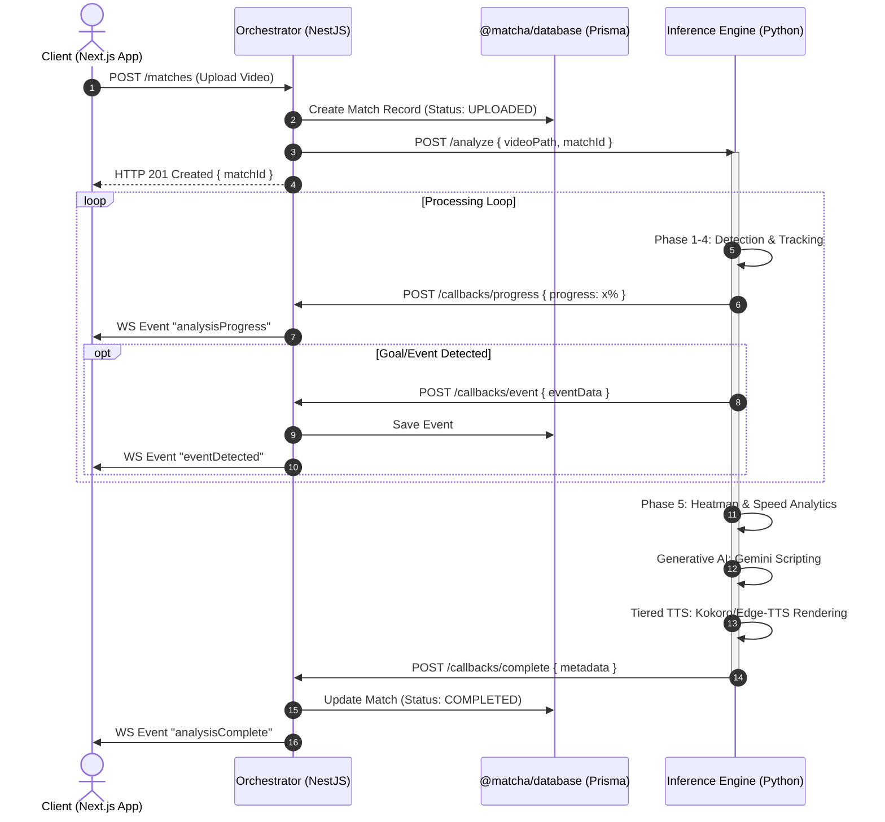
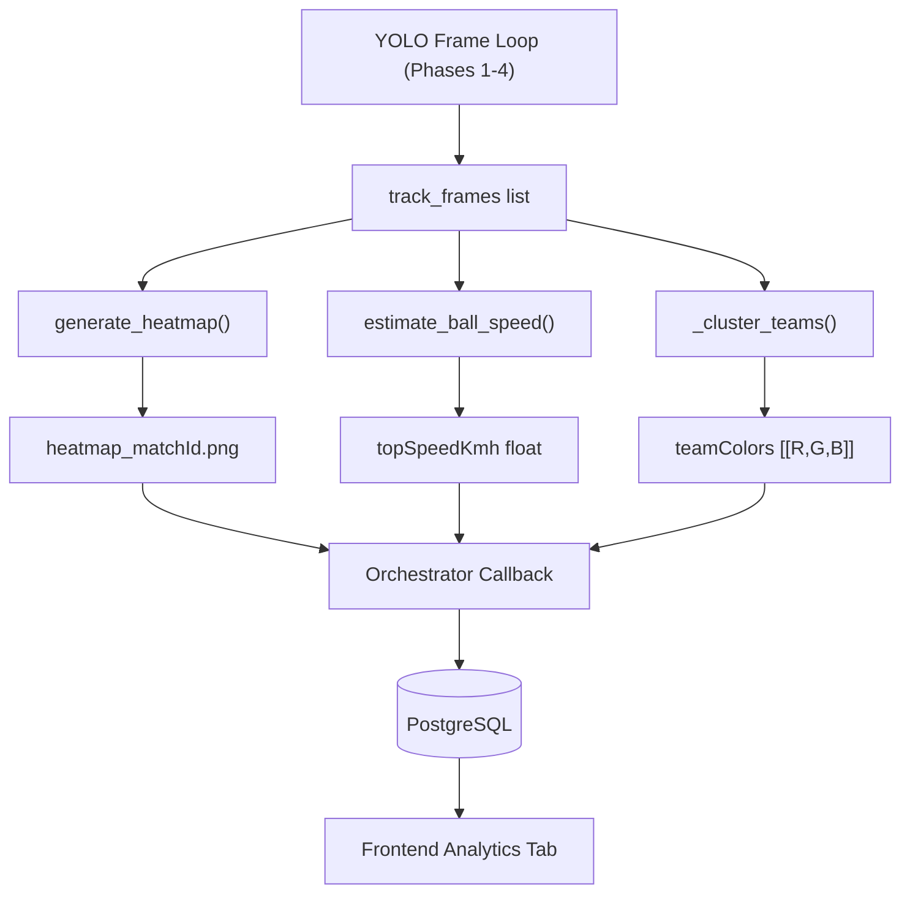
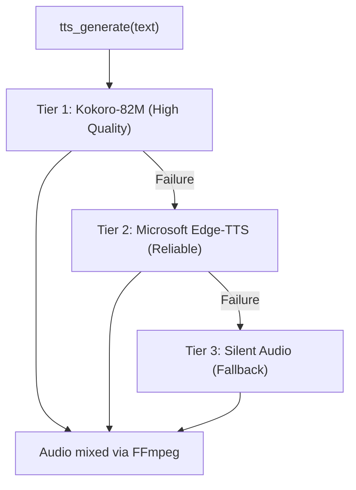

# System Architecture

Matcha-AI-DTU utilizes a microservice-like **Monorepo** architecture leveraging specific languages for their native strengths:

- **TypeScript/React** for dynamic, real-time UI mapping.
- **TypeScript/NestJS** for strictly-typed API gateways and WebSockets.
- **Python/FastAPI** for deep learning AI inference processing.

This document serves to visually explain how data flows across the monorepo when a user initiates a request.

---

## The Core Video Analysis Data flow

The primary end-to-end operation is ingesting a raw video, processing it through YOLO Computer Vision AI models and Large Language Models, and returning a generated Sports Highlight audio synthetic file dynamically to the browser.



---

## Database Schema Diagram

We utilize Prisma ORM for type-safe database queries. The central entities revolve around `Match` and its children like `Event`, `Highlight`, and `Analytics`.

```mermaid
erDiagram
    USER ||--o{ MATCH : "owns"
    MATCH ||--o{ EVENT : "has many"
    MATCH ||--o{ EMOTION_SCORE : "has many"
    MATCH ||--o{ HIGHLIGHT : "has many"

    USER {
        String id PK
        String email UNIQUE
        String password "bcrypt-hashed"
        String name
        DateTime createdAt
    }

    MATCH {
        String id PK
        String userId FK
        String status "UPLOADED | PROCESSING | COMPLETED | FAILED"
        Int progress "0-100"
        Float duration "seconds"
        String summary "AI Narrative"
        String heatmapUrl "PNG Path"
        Float topSpeedKmh "Peak Speed"
        Json teamColors "KMeans Clusters"
        DateTime createdAt
    }

    EVENT {
        String id PK
        String matchId FK
        Float timestamp "seconds"
        String type "GOAL | FOUL | etc."
        Float confidence "0-1"
        String commentary "AI Generated"
    }

    EMOTION_SCORE {
        String id PK
        String matchId FK
        Float timestamp
        Float audioScore
        Float motionScore
        Float finalScore "0-10"
    }

    HIGHLIGHT {
        String id PK
        String matchId FK
        Float startTime
        Float endTime
        Float score "0-10 significance"
        String eventType
        String videoUrl
    }
```

---

## WebSockets Implementation (Socket.io)

For real-time progression we decouple the heavy Python operations from holding HTTP connections open using Callbacks and WebSockets.

1. **NestJS** mounts a Socket.IO Gateway on port `4000`.
2. When the **Inference (Python)** script processes frames, it issues a synchronous _fire-and-forget_ HTTP request to the Orchestrator (`/callbacks/progress`).
3. The **Orchestrator** translates this HTTP payload into an active Socket Event mapped to all connected Next.js users listening to that namespace.
4. If a WebSocket disconnects, the analysis **continues uninterrupted** inside the Python environment.

---

## Analytics Pipeline — Phase 5

After the main event detection loop completes, a **Phase 5 Post-Processing Analytics** pass runs entirely within the inference service using the `track_frames` data accumulated by YOLO.



### Phase 5 Implementation Details

| Component | File | Algorithm |
| --- | --- | --- |
| Heatmap generator | `app/core/heatmap.py` | Accumulate player centroids into 2D grid + Gaussian Blur |
| Ball speed estimator | `app/core/heatmap.py` | Consecutive ball positions × Pitch Dims / Δt (95th-pct) |
| Team colour detector | `app/core/analysis.py` | Torso crop + Median RGB + K-Means (2 clusters) |

---

## TTS Architecture — 3-Tier System

The commentary voiceover system uses a cascading fallback chain:



---

## Frontend Component Architecture

```text
apps/web/
├── app/
│   ├── layout.tsx         # Root Layout (Nav/Footer)
│   ├── page.tsx           # Hero Landing
│   ├── dashboard/         # User Match List
│   └── matches/[id]/      # Deep Analysis View
│       ├── page.tsx       # Main Layout
│       ├── VideoPlayer.tsx# Interactive YOLO Player
│       └── tabs/          # Analytics, Highlights, Timeline
├── components/
│   ├── layout/            # Navbar, Footer
│   └── ui/                # Shadcn primitives
└── lib/                   # Socket clients, API hooks
```

---

## Environment Variables

### Orchestrator (.env)
| Variable | Description |
| --- | --- |
| `DATABASE_URL` | PostgreSQL connection |
| `HF_TOKEN` | HuggingFace token for Kokoro TTS |
| `CORS_ORIGIN` | Frontend URL (localhost:3000) |

### Inference (.env)
| Variable | Description |
| --- | --- |
| `GEMINI_API_KEY` | Gemini 2.0 Flash for Commentary |
| `ORCHESTRATOR_URL` | Callback target (localhost:4000) |

---

## Complete Monorepo Directory Layout

```text
Matcha-AI-DTU/
├── apps/
│   ├── web/               # Next.js 14 Frontend
│   └── mobile/            # Expo React Native
├── packages/
│   └── shared/            # Common Types & Constants
├── services/
│   ├── orchestrator/      # NestJS Backend (Port 4000)
│   └── inference/         # Python FastAPI AI (Port 8000)
├── uploads/               # Shared Asset Storage
├── docs/                  # Documentation
├── turbo.json             # Monorepo Pipeline
└── package.json           # Root Configuration
```

---

## Terminology & Concepts

This section explains significant technical terms used in the Matcha-AI-DTU codebase in plain English.

### Project-Specific Terms

**Monorepo** A single Git repository that contains multiple independent applications and packages. Instead of having separate repositories for the frontend, backend, and AI service, they all live together here. This makes sharing code between them much easier.

**Turborepo** The tool that manages this monorepo. It figures out in what order to build and run each service (e.g., build shared packages before the apps that depend on them), and it caches results so repeated builds are instant.

**Workspace Package** A sub-project inside the monorepo that has its own `package.json`. Examples: `apps/web`, `services/orchestrator`, `packages/shared`. Turborepo treats each as an independent unit but links them together.

**`@matcha/shared`** A shared TypeScript package (in `packages/shared/`) that exports API client functions, TypeScript type definitions, and WebSocket event name constants. Both the frontend and the orchestrator import from this package to stay in sync.

**`@matcha/contracts`** A shared package (in `packages/contracts/`) that exports Zod validation schemas for all API request and response bodies. Using a shared schema means the frontend and backend always agree on the shape of data.

**`@matcha/env`** A shared package (in `packages/env/`) that validates environment variables at application startup using T3-Env. If a required variable (like `DATABASE_URL`) is missing, the app refuses to start with a clear error rather than crashing mysteriously later.

**`@matcha/database`** A shared package (in `packages/database/`) that contains the Prisma schema file and exports the Prisma client. Having one shared schema ensures the database structure is the same everywhere.

**`@matcha/ui`** A shared package (in `packages/ui/`) that contains reusable React components (`ScoreBadge`, `CopyButton`, etc.) used by the web frontend.

**`@matcha/theme`** A shared package (in `packages/theme/`) that exports design tokens — brand colors, font settings, and Tailwind configuration — so all UI looks consistent.

**Analysis Pipeline** The 5-phase sequence of AI processing steps that runs every time a video is uploaded. Phase 1: YOLO tracking. Phase 2: Event detection. Phase 3: Gemini commentary. Phase 4: TTS and highlight reel. Phase 5: Analytics.

**Highlight Reel** A single MP4 video file assembled by FFmpeg containing the top-N best moments from a match, each clip overlaid with scrolling text commentary and mixed with a TTS voiceover, crowd noise, and background music.

**Context Score** A number between 0 and 10 that represents how significant a detected event is. Calculated from: event type importance, motion intensity at that moment, temporal position (late-game events score higher), and detection confidence.

**Track Frames** The list of frame-by-frame data collected by YOLO during Phase 1. Each entry records the timestamp, bounding boxes of all detected players, and the ball position for that frame. Later pipeline phases (heatmap, speed estimation, team color) read this list without re-processing the video.

### AI and Computer Vision

**YOLO (You Only Look Once)** A real-time object detection neural network. This project uses YOLOv8 (version 8 of YOLO) to detect players and the ball in each video frame. "You Only Look Once" refers to the fact that it scans the entire image in one forward pass, making it fast enough for video.

**YOLOv8n / YOLOv8s** Two size variants of the YOLOv8 model. "n" = nano (faster, less accurate, smaller file). "s" = small (slower, more accurate). This project ships both weight files and defaults to the small model.

**Bounding Box (bbox)** A rectangle drawn around a detected object in an image, defined by its top-left corner coordinates plus width and height (or top-left and bottom-right corners). YOLO returns a bounding box for every player and ball it detects.

**Confidence Score** A number between 0.0 and 1.0 that YOLO assigns to each detection. 1.0 means the model is completely certain that object is a player or ball. 0.4 means it is only 40% sure. Detections below a threshold (e.g., 0.3) are discarded.

**Track ID** A number YOLO assigns to a specific object across multiple frames so it can be followed over time. If YOLO detects player #5 in frame 100 and frame 150, both detections share the same track ID (assuming it did not lose the player in between).

**SoccerNet** An open-source research project and dataset from EPFL that provides pre-trained models for detecting football-specific actions (goals, fouls, cards, corners, etc.) in broadcast video. This project uses their action recognition model as one of the event detection methods.

**Homography** A mathematical transformation (a 3x3 matrix) that maps points from one plane to another. Here it is used to convert the 2D pixel coordinates of the ball in the camera frame to real-world coordinates on the football pitch. This makes it possible to determine if the ball has crossed the goal line regardless of where the camera is positioned.

**Kalman Filter** A mathematical algorithm that estimates the true position of a moving object given noisy measurements. The ball's position detected by YOLO jumps around slightly between frames due to detection noise. The Kalman filter smooths this path to produce a more accurate trajectory for goal detection.

**Finite State Machine (FSM)** A system that can be in exactly one of a finite number of states at any time and transitions between states based on defined rules. The goal detection engine uses an FSM with states like TRACKING, APPROACHING_GOAL, CROSSED_LINE, and CONFIRMED_GOAL to decide when a goal has definitely occurred.

**Heatmap** A color-coded image overlaid on a football pitch diagram that shows where players spent the most time during a match. Areas where players concentrated appear as warm colors (red, orange). Areas with little activity appear as cool colors (blue, green).

**Gaussian Blur** A smoothing operation applied to an image that makes sharp edges and point values spread out into their surrounding pixels. Applied to the raw player position counts before rendering the heatmap to make it look smooth and continuous rather than a grid of sharp dots.

**K-Means Clustering** A machine learning algorithm that groups data points into K clusters based on similarity. Used here to group all detected players' jersey colors into 2 clusters (one per team), automatically identifying which color belongs to which team.

**OpenCV (`cv2`)** An open-source computer vision library for Python and C++. Used in this project for reading video files frame by frame, drawing the heatmap pitch diagram, and applying image transformations.

### Backend and Infrastructure

**NestJS** A TypeScript framework for building server-side Node.js applications. It uses a module-based architecture similar to Angular. The orchestrator (`services/orchestrator/`) is built with NestJS.

**FastAPI** A modern Python web framework for building APIs. It automatically generates interactive documentation and uses Python type hints for validation. The AI inference engine (`services/inference/`) is built with FastAPI.

**Prisma** A TypeScript ORM (Object-Relational Mapper) for working with databases. Instead of writing raw SQL, you define your data model in a `schema.prisma` file and Prisma generates type-safe functions like `prisma.match.create()` and `prisma.user.findMany()`.

**Prisma Migration** A versioned record of a change to the database schema. When you add a new field to the Prisma schema, running `prisma migrate dev` creates a migration file (an SQL file) and applies it to the database. Migrations ensure everyone's database has the same structure.

**Prisma Client** The auto-generated TypeScript library that Prisma creates from your schema. It provides type-safe functions for all database operations. Regenerated every time the schema changes by running `prisma generate`.

**PostgreSQL** A powerful open-source relational database. Stores all persistent data: users, matches, events, highlights, and analytics results. Runs in a Docker container on port 5433 in this project.

**Redis** An in-memory key-value store. Used in this project to track the state of active analysis jobs (e.g., which matches are currently being processed) without querying PostgreSQL for every progress update.

**Docker / Docker Compose** Docker packages software into containers — isolated environments that include the application and all its dependencies. Docker Compose is a tool for defining and running multiple containers together with a single command (`docker-compose up`). This project uses it to run PostgreSQL, Redis, and MinIO containers.

**MinIO** An open-source object storage server compatible with Amazon S3. Defined in `docker-compose.yml` for planned use as scalable file storage for uploaded videos and generated assets. Currently not yet integrated (see ROADMAP.md Phase 5.4).

**JWT (JSON Web Token)** A compact, self-contained token used for authentication. When a user logs in, the server generates a JWT signed with a secret key. The client sends this token with every subsequent request in the `Authorization: Bearer <token>` header. The server verifies the signature to confirm the request is from an authenticated user.

**WebSocket** A communication protocol that keeps a persistent two-way connection open between the browser and server. Unlike standard HTTP where the client must ask for updates, WebSockets allow the server to push events to the browser at any time. Used here to send real-time analysis progress and event notifications to the frontend.

**Socket.IO** A JavaScript library built on top of WebSockets that adds features like automatic reconnection, room-based broadcasting, and fallback to HTTP long-polling. The NestJS orchestrator uses Socket.IO's gateway to push `analysisProgress` and `eventDetected` events to connected browsers.

**CORS (Cross-Origin Resource Sharing)** A browser security mechanism that blocks a web page from making requests to a different domain than the one that served the page. Since the frontend runs on port 3000 and the orchestrator on port 4000, CORS must be explicitly configured to allow this. Controlled via the `CORS_ORIGIN` environment variable.

**Zod** A TypeScript-first schema validation library. Used in `@matcha/contracts` to define the exact shape and types of all API request and response objects. If incoming data does not match the schema, Zod rejects it before it reaches the business logic.

**T3-Env** A library (from the T3 Stack community) that validates environment variables at startup using Zod schemas. Used in `@matcha/env` to ensure all required variables are present and correctly formatted before any service starts.

### AI and Language Models

**Gemini (Google Gemini)** Google's family of large language models (LLMs). This project uses Gemini 2.0 Flash via the Google AI Studio API to generate broadcast-style event commentary and match summary narratives.

**LLM (Large Language Model)** A type of AI model trained on vast amounts of text data that can generate, summarize, translate, and reason about natural language. Gemini is an example.

**TTS (Text-to-Speech)** Technology that converts written text into spoken audio. This project uses a 3-tier TTS pipeline to synthesize event commentary into audio for inclusion in the highlight reel.

**Kokoro-82M** An 82-million parameter open-source TTS model hosted on HuggingFace (`hexgrad/Kokoro-82M`). Ranked first in the TTS-Spaces-Arena leaderboard. Used as Tier 1 (highest quality) in the TTS pipeline. Requires a HuggingFace API token.

**edge-tts** A Python library that calls Microsoft's Azure Cognitive Services TTS API (the same engine behind Microsoft Edge's built-in read-aloud feature). Used as Tier 2 in the TTS pipeline. Does not require an API key.

**HuggingFace** A platform that hosts open-source AI models, datasets, and demos. The Kokoro-82M TTS model is downloaded from HuggingFace. A free HuggingFace token (`HF_TOKEN`) is recommended to avoid rate limits.

**FFmpeg** A command-line tool for processing audio and video files. Used in this project to: cut video clips, overlay text, mix audio tracks (commentary + crowd noise + music), concatenate multiple clips into the highlight reel, and optionally compress large input videos.

### Frontend

**Next.js** A React framework for building web applications. This project uses Next.js 15 with the App Router (the newer routing system based on the `app/` directory). Runs on port 3000.

**App Router** The newer Next.js routing system (introduced in Next.js 13). Routes are defined by folder structure inside `app/`. Each folder can have a `page.tsx` (the rendered page), `layout.tsx` (a persistent wrapper), and `loading.tsx` (a loading state).

**shadcn/ui** A collection of pre-built, accessible React UI components (buttons, dialogs, tabs, etc.) that can be copied directly into your project and customized. Used in `apps/web/` for UI primitives.

**`@react-pdf/renderer`** A React library for generating PDF files directly in the browser (no server required). Used to generate the downloadable Match Report PDF from match data.

### Development Tools

**npm Workspaces** A feature of npm that allows multiple packages in the same repository to share a single `node_modules` folder and link to each other by name. This is what makes `import { something } from '@matcha/shared'` work without publishing to npm.

**Conventional Commits** A standardized format for Git commit messages. Format: `type: description`. Common types: `feat` (new feature), `fix` (bug fix), `docs` (documentation), `style` (formatting), `refactor`, `chore`. Example: `feat: add ball speed display to analytics tab`.

**Hot Reload** A development feature where the application automatically updates in the browser when you save a file, without requiring a full manual restart. Next.js and NestJS both support hot reload in development mode.

**Virtual Environment (`venv`)** A Python tool that creates an isolated Python environment for a project. Packages installed inside the venv do not affect system Python or other projects. Always activate the venv (`.\venv\Scripts\activate` on Windows) before running Python commands in `services/inference/`.

**`requirements.txt`** A plain text file listing all Python package dependencies for the inference service. Running `pip install -r requirements.txt` installs all of them at once.
