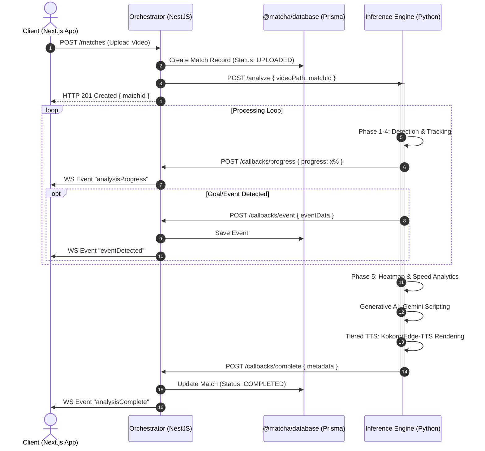
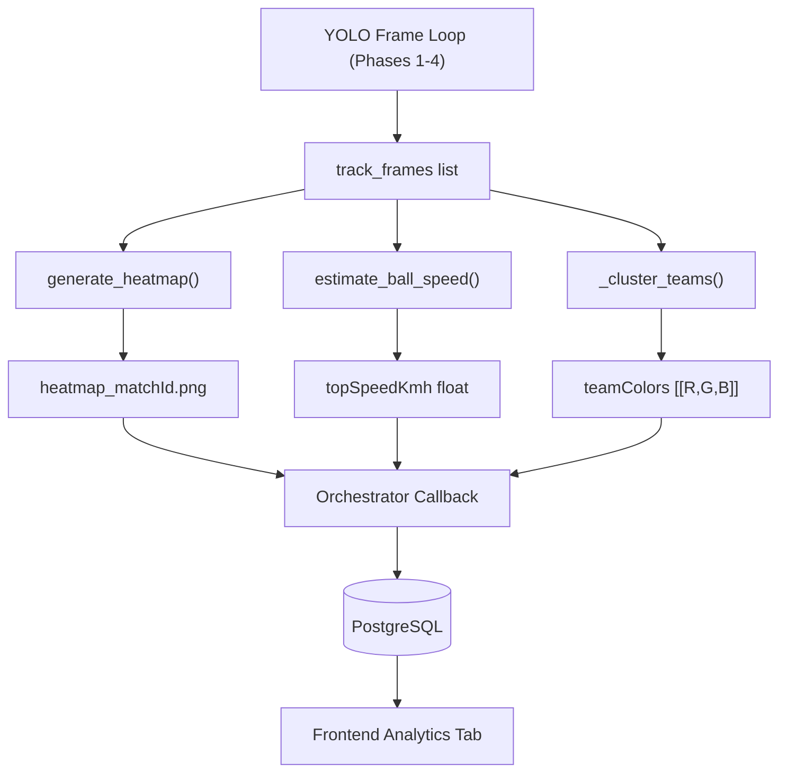
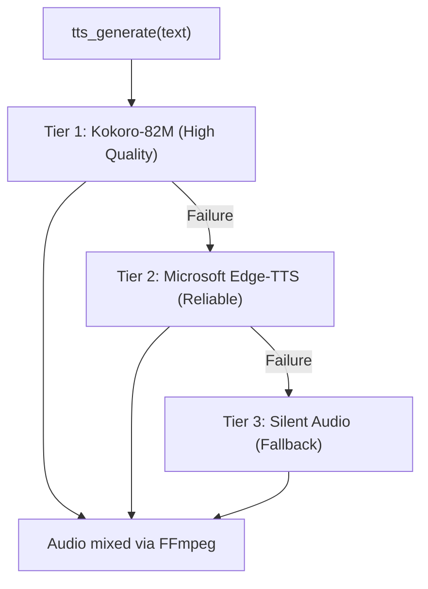

# System Architecture

Matcha-AI-DTU utilizes a microservice-like **Monorepo** architecture leveraging specific languages for their native strengths:

- **TypeScript/React** for dynamic, real-time UI mapping.
- **TypeScript/NestJS** for strictly-typed API gateways and WebSockets.
- **Python/FastAPI** for deep learning AI inference processing.

This document serves to visually explain how data flows across the monorepo when a user initiates a request.

---

## The Core Video Analysis Data flow

The primary end-to-end operation is ingesting a raw video, processing it through YOLO Computer Vision AI models and Large Language Models, and returning a generated Sports Highlight audio synthetic file dynamically to the browser.



---

## Database Schema Diagram

We utilize Prisma ORM for type-safe database queries. The central entities revolve around `Match` and its children like `Event`, `Highlight`, and `Analytics`.

```mermaid
erDiagram
    USER ||--o{ MATCH : "owns"
    MATCH ||--o{ EVENT : "has many"
    MATCH ||--o{ EMOTION_SCORE : "has many"
    MATCH ||--o{ HIGHLIGHT : "has many"

    USER {
        String id PK
        String email UNIQUE
        String password "bcrypt-hashed"
        String name
        DateTime createdAt
    }

    MATCH {
        String id PK
        String userId FK
        String status "UPLOADED | PROCESSING | COMPLETED | FAILED"
        Int progress "0-100"
        Float duration "seconds"
        String summary "AI Narrative"
        String heatmapUrl "PNG Path"
        Float topSpeedKmh "Peak Speed"
        Json teamColors "KMeans Clusters"
        DateTime createdAt
    }

    EVENT {
        String id PK
        String matchId FK
        Float timestamp "seconds"
        String type "GOAL | FOUL | etc."
        Float confidence "0-1"
        String commentary "AI Generated"
    }

    EMOTION_SCORE {
        String id PK
        String matchId FK
        Float timestamp
        Float audioScore
        Float motionScore
        Float finalScore "0-10"
    }

    HIGHLIGHT {
        String id PK
        String matchId FK
        Float startTime
        Float endTime
        Float score "0-10 significance"
        String eventType
        String videoUrl
    }
```

---

## WebSockets Implementation (Socket.io)

For real-time progression we decouple the heavy Python operations from holding HTTP connections open using Callbacks and WebSockets.

1. **NestJS** mounts a Socket.IO Gateway on port `4000`.
2. When the **Inference (Python)** script processes frames, it issues a synchronous _fire-and-forget_ HTTP request to the Orchestrator (`/callbacks/progress`).
3. The **Orchestrator** translates this HTTP payload into an active Socket Event mapped to all connected Next.js users listening to that namespace.
4. If a WebSocket disconnects, the analysis **continues uninterrupted** inside the Python environment.

---

## Analytics Pipeline — Phase 5

After the main event detection loop completes, a **Phase 5 Post-Processing Analytics** pass runs entirely within the inference service using the `track_frames` data accumulated by YOLO.



### Phase 5 Implementation Details

| Component | File | Algorithm |
| --- | --- | --- |
| Heatmap generator | `app/core/heatmap.py` | Accumulate player centroids into 2D grid + Gaussian Blur |
| Ball speed estimator | `app/core/heatmap.py` | Consecutive ball positions × Pitch Dims / Δt (95th-pct) |
| Team colour detector | `app/core/analysis.py` | Torso crop + Median RGB + K-Means (2 clusters) |

---

## TTS Architecture — 3-Tier System

The commentary voiceover system uses a cascading fallback chain:



---

## Frontend Component Architecture

```text
apps/web/
├── app/
│   ├── layout.tsx         # Root Layout (Nav/Footer)
│   ├── page.tsx           # Hero Landing
│   ├── dashboard/         # User Match List
│   └── matches/[id]/      # Deep Analysis View
│       ├── page.tsx       # Main Layout
│       ├── VideoPlayer.tsx# Interactive YOLO Player
│       └── tabs/          # Analytics, Highlights, Timeline
├── components/
│   ├── layout/            # Navbar, Footer
│   └── ui/                # Shadcn primitives
└── lib/                   # Socket clients, API hooks
```

---

## Environment Variables

### Orchestrator (.env)
| Variable | Description |
| --- | --- |
| `DATABASE_URL` | PostgreSQL connection |
| `HF_TOKEN` | HuggingFace token for Kokoro TTS |
| `CORS_ORIGIN` | Frontend URL (localhost:3000) |

### Inference (.env)
| Variable | Description |
| --- | --- |
| `GEMINI_API_KEY` | Gemini 2.0 Flash for Commentary |
| `ORCHESTRATOR_URL` | Callback target (localhost:4000) |

---

## Complete Monorepo Directory Layout

```text
Matcha-AI-DTU/
├── apps/
│   ├── web/               # Next.js 14 Frontend
│   └── mobile/            # Expo React Native
├── packages/
│   └── shared/            # Common Types & Constants
├── services/
│   ├── orchestrator/      # NestJS Backend (Port 4000)
│   └── inference/         # Python FastAPI AI (Port 8000)
├── uploads/               # Shared Asset Storage
├── docs/                  # Documentation
├── turbo.json             # Monorepo Pipeline
└── package.json           # Root Configuration
```
